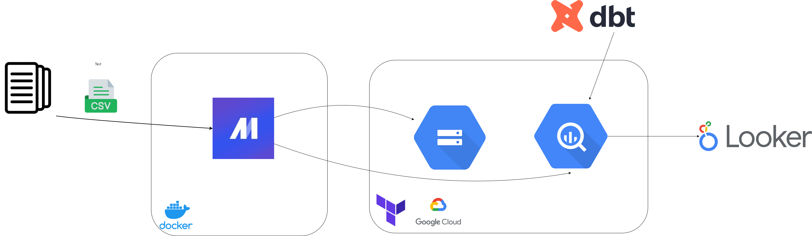
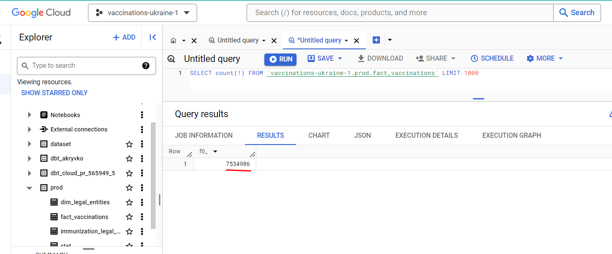
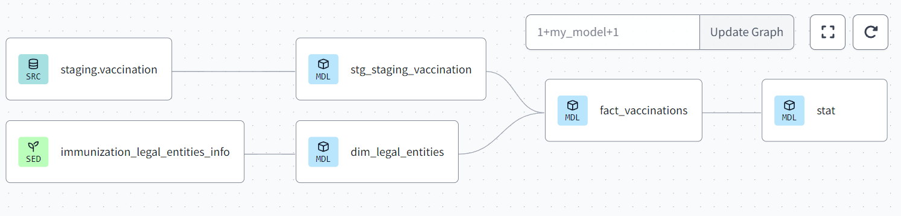
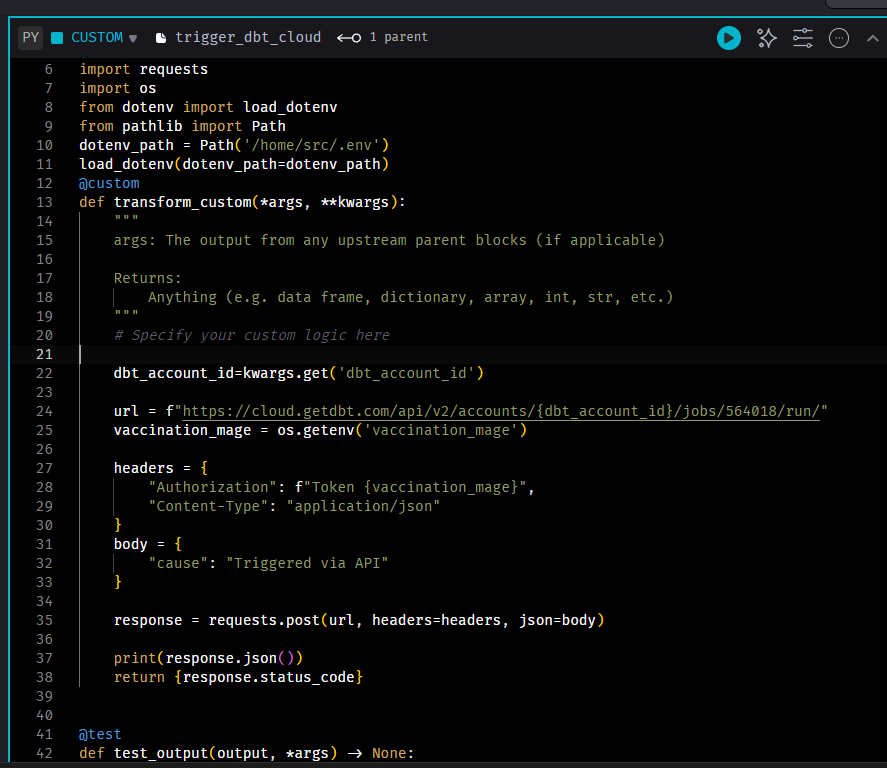
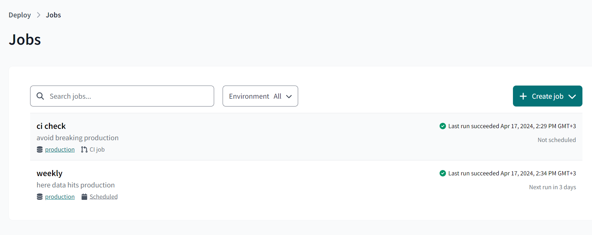
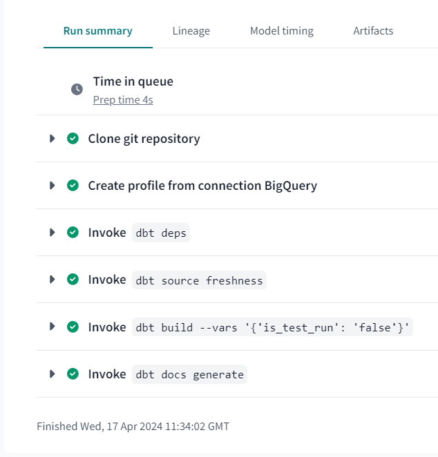
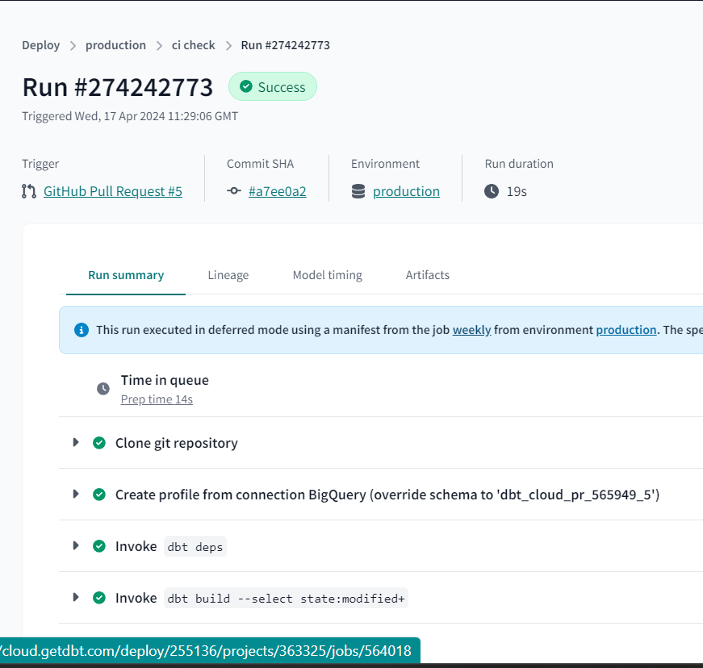
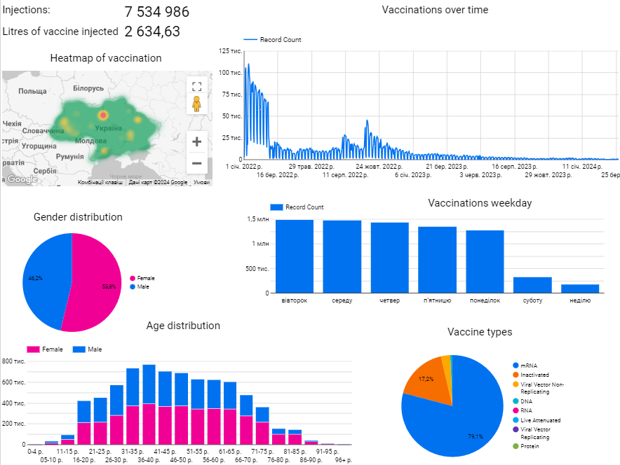

## Overview
This project aims to extract, load, transform, aggregate the information to analyze trends over time, and generate comprehensive analysis of Ukraine Vaccination dataset. This data includes information such as vaccine type, vaccination settlement, dose value, manufacturer, and vaccination date. This project aims to offer stakeholders reliable and up-to-date vaccination records, empowering them to make informed decisions related to developing vaccination strategies, tracking vaccination progress, and identifying areas that require additional support.


Also, this project fulfills the final requirement to complete the [DataTalksClub](https://github.com/DataTalksClub/data-engineering-zoomcamp/tree/main) course for 2024.


## Project Structure
The project has been structured with the following folders and files:

- [0_dataload](https://github.com/Nogromi/ukraine-vaccinations/tree/master/0_dataload): A notebooks for exploartion adn draft code 
- [1_terraform](https://github.com/Nogromi/ukraine-vaccinations/tree/master/1_terraform): IaC stream-based pipeline infrastructure in GCP using Terraform
- [2_mage](https://github.com/Nogromi/ukraine-vaccinations/tree/master/2_mage): Workflow orchestration pipeline
- [03_dbt](https://github.com/Nogromi/ukraine-vaccinations/tree/master/03_dbt): For analytics engineering. Data transformation and CI/CD pipeline.
- environment:  Optional: conda environment.yml. Needed only of runnig data_investigation.ipynb. to activate run this command
bash
```
conda env create --file environment.yaml
``` 
- images: screenshots of results

## Architecture
   


## Pipeline description

 ### Batch data ingestion.
Getting the data from sources using Mage orchestration with two pipelines: master and slave pipeline. The master pipeline triggers the slave pipeline using global variables. It downloads data for each quarter of a year. Note: See Further Improvements chapter. Then it does silver level transformation, deleting NaNs and invalid data.

### Data warehouse
Next, it pushes the data to Google Cloud, applying partitioning on a date basis. Eventually, the Master pipeline fetches all data from Google Cloud Storage and loads it into BigQuery.

  

 ### Transformations

I use dbt cloud  for transformations  on vaccination dataset. 
 After that it triggers dbt job using through DBT API. Explore data transitions from  Silver to Gold transformation made with dbt cloud  in the 03_dbt/models/stg, 03_dbtdbt/models/core.
  

'

Also, I trigger prod run in master pipeline.





and CI check on Github pull request.



  ### Visualization
  Finally, a dashboard in Looker to explore some data and aggregations. This  dashboard display the gender and age vaccination distribution, manufacturer proportions and highlights the correlation between weekday, The significant decline in vaccination rates occurred on February 24, 2022, coinciding with the commencement of Russia's full-scale invasion of Ukraine.
   
  Checkout my [dashboard](https://lookerstudio.google.com/s/lp2c8ZDbDgs):
  


## Reproducing the repo


Create a GCP account if you don't have it yet.

In GCP Console create a new project. Give the project an appropriate name and take note of the project ID.

Prepare GCP service accounts with appropriate permissions for GCS and BQ


   - Create a service [account](https://cloud.google.com/iam/docs/service-accounts-create).
   - Click on the "Keys" tab and then click the "Add Key" button.
   - Select the "JSON" key type and click "Create" to download the private key file. This key would be used to interact to the google API from Mage.
   - Store the json key locally `/home/anatolii/credentials/vaccination/key.json" # change it to your path`.
Give it exactly the name `key.json`.

This application communicates with several APIs. Make sure you have enabled all APIs when required (GCS, BigQuery, etc).

Install [gcloud](https://cloud.google.com/sdk/docs/install) locally. If you face errors make sure you installed `/Documents/secrets/personal-gcp.json`

Prepare infrastructure for the project with Terraform
Download [Terraform](https://developer.hashicorp.com/terraform/install) and move into the terraform folder `cd 1_terraform/`. Follow the insstructions in the folder's README file.
[download]


### Running the Code.

 Move into the mage folder `cd 2_mage/`. Follow the insstructions in the folder's README file. Now, navigate to http://localhost:6789 in your browser! Find the pipelines tab, click on trigger_run_vaccination (this is the master pipeline) and click on Run@once. This will trigger the vaccination_ukraine pipeline for the corresponding data link.

Transformations
Connect your dbt cloud to Bigquery and Github repo. 

Create a deploy job on the prod dataset.

Visualisation 
navigagte to [Google looker studio]((https://lookerstudio.google.com/navigation/reporting))

Connect your dataset using the BigQuery Connector.

Select your project name, then select the dataset. This would bring you to the dashboard page.

Create your visualizations and share.


## Further Improvements (Work In Progress)

At the moment, I loaded 7 million rows using mage locally. However, it has to download 13 CSV zipped files with various sizes. It easily downloads the data for 2022-2024 years, but for the year 2021, it requires huge RAM because each CSV contains 12 million rows or more. This part requires improvement of reading the file using different methods such as PySpark to resolve the issue.

- Move to PySpark for more efficient loading.
- Move Mage pipeline to cloud.
- Implement data quality checks to catch any potential errors in the dataset.
- Create unit tests to ensure the pipeline is running as intended.


Last Note:

 <font color="red">IMPORTANT!!</font>: When you are done you can destroy the GCP bjects :
```shell
# Delete infra after your work, to avoid costs on any running services
terraform destroy
```
Hack: You can use a GitHub Codespace to run this demo, it's installed both Docker and Git. See [more](https://youtu.be/XOSUt8Ih3zA&list=PL3MmuxUbc_hJed7dXYoJw8DoCuVHhGEQb&index=15).